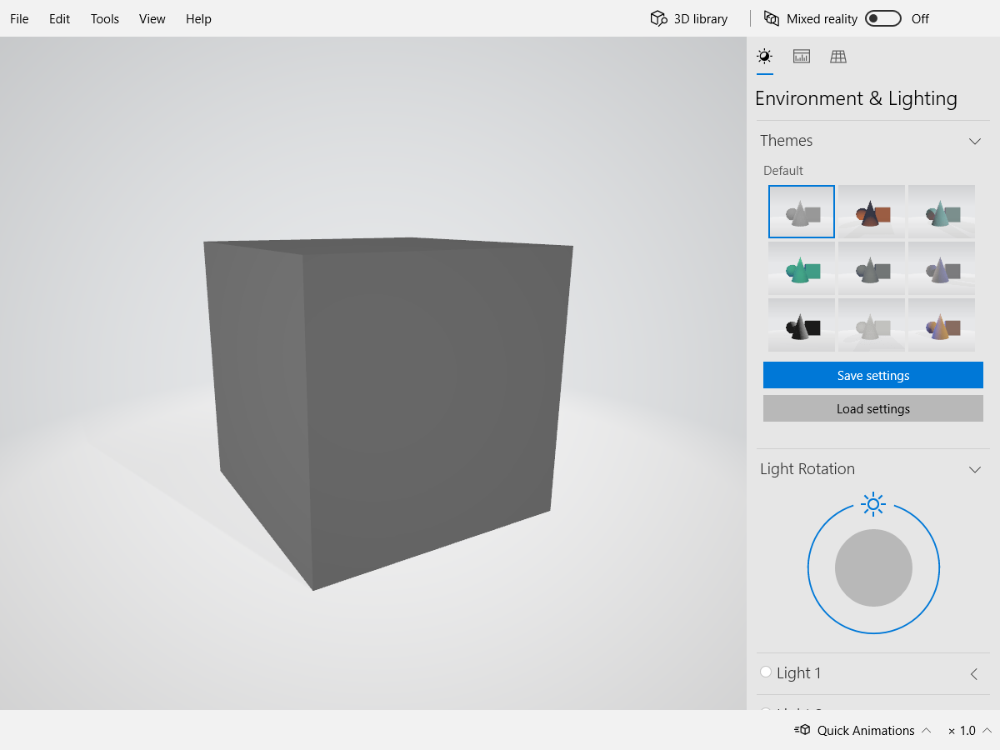
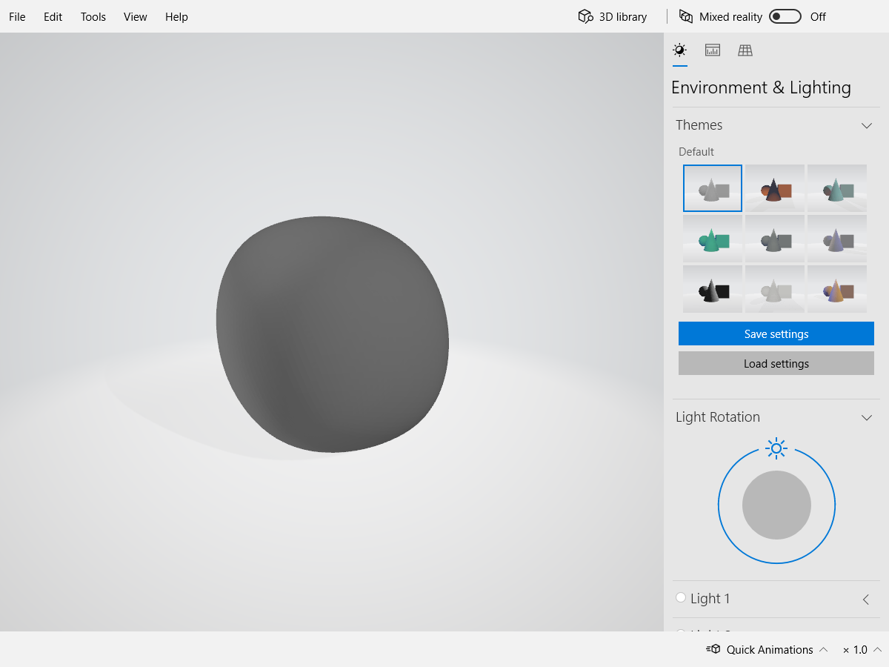

# B-5 SnowStorm

- 王宸昊
- 2019214541
- wch19@mails.tsinghua.edu.cn

## 实验要求

网格简化算法

1. 复现Surface Simplification Using Quadric Error Metrtcs

## 实验环境

- OSX
- CMake
- GCC
- OpenGL
- GLUT
- GLEW
- GLM
- SOIL

## 运行

```bash
mkdir build
cd build
cmake ..
make
./MeshSubSimp [--width=x] [--height=y] [--title=”Chenhao Wang 2019214541”]
```

## 实验原理

本项目暂时只实现了三角网格的细分，就是Loop Subdivision算法

读取三维网格模型，将所有的边转为半边。

更新旧顶点：第一步，遍历所有半边，找到一条以该顶点为起始顶点的半边。第二步，通过这条半边找到它的next半边，next半边的origin为v1。再找next半边的next半边 的opposite半边，进入下一个面。第三步，重复第二步直到找到的origin点vi等于v1，则已经找到所有vi，可计算出旧顶点的更新后坐标。

在每条旧边上生成新顶点：遍历每一条半边，通过半边和半边的opposite边的next与origin找到两个面的所有顶点，计算出新的顶点。

已经得到了所有新的顶点，连接它们得到新的半边和面。画出新图，细分完成。


## 实验效果






